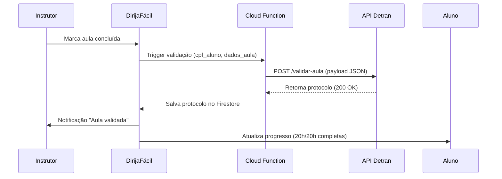

# Software Requirements Specification (SRS)
## DirijaFácil - Plataforma de Conexão Instrutor-Aluno CNH

---

## 1. Introdução

### 1.1 Propósito
Este documento especifica requisitos funcionais e não-funcionais para o **DirijaFácil**, aplicativo mobile que conecta instrutores autônomos credenciados pelo Detran a candidatos à CNH no Brasil, conforme Resolução Contran nº 978/2025.

### 1.2 Escopo
**Objetivo**: Democratizar acesso à habilitação veicular com redução de custos (até 80%) e regularização de motoristas.  
**Plataformas**: Android/iOS (cross-platform).  
**Público-alvo**:
- Alunos (18+ anos)
- Instrutores autônomos credenciados (21+ anos, CNH com EAR)
- Administradores (moderação/suporte)

### 1.3 Conformidade Regulatória
- **CTB** (Código de Trânsito Brasileiro)
- **Contran nº 978/2025** (aulas independentes)
- **LGPD** (Lei Geral de Proteção de Dados)
- **Resoluções estaduais** dos Detrans (validação por UF)

### 1.4 Stack Tecnológico Sugerido
- **Frontend**: React Native (TypeScript)
- **Backend**: Firebase (Firestore, Cloud Functions, Auth, Storage)
- **Pagamentos**: Mercado Pago SDK, PIX API
- **Mapas**: Google Maps API / Mapbox
- **OCR**: Google Cloud Vision API
- **Push**: Firebase Cloud Messaging (FCM)
- **Analytics**: Firebase Analytics + Crashlytics

---

## 2. Requisitos Não-Funcionais Globais

### 2.1 Performance
- Latência < 500ms em buscas e consultas
- Tempo de carregamento inicial < 3s
- Suporte offline para visualização de agendamentos/perfis (sync automático)

### 2.2 Escalabilidade
- **Capacidade**: 1M+ MAU (Monthly Active Users)
- **Arquitetura**: Serverless com auto-scaling (Firebase Cloud Functions)
- **Caching**: Redis para queries frequentes

### 2.3 Segurança
- **Autenticação**: Firebase Auth (CPF/e-mail/SMS)
- **Criptografia**: AES-256 para dados sensíveis, TLS 1.3 em trânsito
- **LGPD**:
    - Consentimento explícito para geolocalização/pagamentos
    - Anonimização de dados após 5 anos de inatividade
    - Direito ao esquecimento (remoção completa via painel)
- **Verificação**: Integração Serasa/SPC para antecedentes criminais (opcional para instrutores)

### 2.4 Acessibilidade
- **WCAG 2.1 Nível AA**:
    - Contraste mínimo 4.5:1
    - Suporte a leitores de tela (TalkBack/VoiceOver)
    - Tamanhos de fonte ajustáveis

### 2.5 Localização
- **Idioma**: Português-BR
- **Moeda**: BRL (R$)
- **Fusos**: Automático por geolocalização (UTC-2 a UTC-5)

---

## 3. Requisitos Funcionais

### 3.1 Módulo: Cadastro e Autenticação

#### RF-01: Registro de Aluno
**User Story**: *Como aluno, quero criar conta com CPF/e-mail para acessar instrutores credenciados.*

**Critérios de Aceitação**:
- Validação CPF via algoritmo (dígitos verificadores)
- Campos obrigatórios: nome completo, data nascimento (≥18 anos), telefone, senha (≥8 caracteres, 1 maiúscula, 1 número)
- Upload docs: RG/CNH (frente/verso), comprovante residência (até 90 dias)
- Verificação e-mail via link; SMS via código 6 dígitos
- Status inicial: `ativo`

**Wireframe Textual**:
```
[Tela Cadastro Aluno]
┌─────────────────────────┐
│ Logo DirijaFácil        │
│ [Campo: CPF]            │
│ [Campo: Nome Completo]  │
│ [Campo: Data Nasc.]     │
│ [Campo: Telefone]       │
│ [Campo: E-mail]         │
│ [Campo: Senha]          │
│ [Upload: Doc Identidade]│
│ [Checkbox: Aceito LGPD] │
│ [Botão: Criar Conta]    │
└─────────────────────────┘
```

---

#### RF-02: Registro de Instrutor
**User Story**: *Como instrutor, quero cadastrar meu perfil com credenciais Detran para oferecer aulas.*

**Critérios de Aceitação**:
- Campos adicionais: idade ≥21, categorias habilitadas (A/B/C/D/E/ACC), anos experiência (≥2)
- Uploads obrigatórios:
    - CNH válida com EAR (OCR extrai número/validade)
    - Certificado Detran (PDF/JPEG, validação via API estadual)
    - Comprovante antecedentes criminais (opcional)
- Dados veículo: modelo, placa (validação via API Denatran), ano (≤12 anos), tipo (manual/automático), identificação visual obrigatória ("Auto-Escola")
- Status inicial: `pendente` → aprovação admin/automática
- Preço/hora: R\$50-150 (default R\$80)

**Validações Automáticas**:
- Trigger Cloud Function: verifica CNH no sistema Detran (timeout 10s)
- Aprova se docs válidos; rejeita caso contrário
- Notificação push + e-mail com resultado

---

#### RF-03: Perfil de Usuário
**User Story**: *Como usuário, quero visualizar/editar meu perfil para manter dados atualizados.*

**Aluno**:
- Seções: Dados pessoais, Preferências (categoria desejada, orçamento, horários), Progresso (horas cursadas), Histórico aulas
- Edição: Nome, telefone, foto, endereço, preferências

**Instrutor**:
- Seções: Dados pessoais, Veículo, Categorias, Disponibilidade (calendário), Estatísticas (rating, alunos atendidos, taxa aprovação)
- Edição: Preço, calendário, foto veículo (com aprovação admin se alterar placa)

---

### 3.2 Módulo: Busca e Matching

#### RF-04: Busca de Instrutores
**User Story**: *Como aluno, quero buscar instrutores próximos por filtros para escolher o ideal.*

**Filtros**:
- **Localização**: Raio (10/20/50km), endereço específico
- **Categoria**: A/B/C/D/E/ACC (multi-select)
- **Preço**: Range R\$50-150
- **Rating**: Mínimo (3.0/4.0/4.5)
- **Disponibilidade**: Hoje, Esta semana, Próximos 7 dias
- **Tipo veículo**: Manual/Automático
- **Outros**: Aceita iniciantes, Acessível PcD

**Algoritmo de Matching**:
1. **Geolocalização**: Haversine formula (distância GPS)
2. **Score ponderado**:
    - Proximidade (40%)
    - Rating (30%)
    - Preço compatível (20%)
    - Disponibilidade imediata (10%)
3. Limit: 10 resultados ordenados por score

**Wireframe Textual**:
```
[Tela Busca]
┌─────────────────────────┐
│ [Input: Local/CEP]      │
│ [Slider: Raio 10-50km]  │
│ [Chips: Cat. A B C D E] │
│ [Toggle: Mapa/Lista]    │
├─────────────────────────┤
│ [Mapa com Pins]         │
│  📍 João - R$70 - 4.8⭐ │
│  📍 Maria - R$65 - 4.9⭐│
├─────────────────────────┤
│ [Card Instrutor 1]      │
│  Foto | Nome | Rating   │
│  Categorias | Distância │
│  [Botão: Ver Perfil]    │
└─────────────────────────┘
```

---

#### RF-05: Perfil Detalhado do Instrutor
**User Story**: *Como aluno, quero ver detalhes completos do instrutor antes de agendar.*

**Seções**:
- **Cabeçalho**: Foto, nome, rating (média + nº avaliações), selo "Verificado Detran"
- **Sobre**: Bio (até 300 chars), categorias, anos experiência
- **Veículo**: Modelo, ano, foto, tipo (manual/automático)
- **Preços**: Por hora, pacotes (ex: 10h com 10% off)
- **Disponibilidade**: Calendário mensal com slots livres
- **Avaliações**: Últimas 5 + filtro por rating
- **Localização**: Área atendida (mapa)

---

### 3.3 Módulo: Agendamento de Aulas

#### RF-06: Criar Agendamento
**User Story**: *Como aluno, quero agendar aula com instrutor selecionado para garantir horário.*

**Fluxo**:
1. Aluno seleciona instrutor → Calendário
2. Escolhe data/hora (slots de 1h, blocos contínuos até 4h)
3. Define local de encontro (endereço ou ponto de referência)
4. Especifica: Categoria, Foco (manobras/rodovia/estacionamento)
5. Confirmação: Resumo + valor total
6. Depósito de 20% via PIX (QR Code instantâneo)
7. Instrutor recebe notificação; aceita em até 2h (ou aula cancela com reembolso automático)

**Validações**:
- **Bloqueio atômico**: Transação Firestore com locks para evitar double-booking
- **Disponibilidade**: Verificar calendário do instrutor em tempo real
- **Idade veículo**: Alertar se > 10 anos (warning)

**Wireframe Textual**:
```
[Tela Agendar]
┌─────────────────────────┐
│ Instrutor: João Silva   │
│ [Calendário Mensal]     │
│  Seg Ter Qua Qui Sex    │
│   15  16  17  18  19    │
│  [Slots Disponíveis]    │
│   ☑ 08:00  ☑ 10:00      │
├─────────────────────────┤
│ [Input: Local Encontro] │
│ [Dropdown: Categoria B] │
│ [Chips: Foco da Aula]   │
│  ○ Manobras ○ Rodovia   │
├─────────────────────────┤
│ Resumo:                 │
│ Data: 18/05 às 10:00    │
│ Duração: 2h             │
│ Valor: R$ 140           │
│ Depósito: R$ 28 (PIX)   │
│ [Botão: Confirmar]      │
└─────────────────────────┘
```

---

#### RF-07: Gerenciar Agendamentos
**User Story**: *Como instrutor/aluno, quero visualizar/gerenciar minhas aulas agendadas.*

**Funcionalidades**:
- **Lista**: Filtros (Próximas, Passadas, Canceladas)
- **Detalhes**: Status (Pendente/Confirmada/Concluída/Cancelada), localização, contato
- **Ações**:
    - **Aluno**: Cancelar (<24h grátis; >24h multa 50%), Reagendar (1x grátis), Iniciar chat
    - **Instrutor**: Confirmar, Cancelar (multa 100% se <12h), Marcar concluída

**Notificações**:
- Push 24h antes: "Lembrete: aula amanhã às 10h com João"
- Push 1h antes: "Sua aula começa em breve"
- SMS ao instrutor em confirmação

---

#### RF-08: Tracking em Tempo Real
**User Story**: *Como aluno, quero acompanhar localização durante aula para segurança.*

**Critérios**:
- Opt-in obrigatório (consentimento LGPD)
- Compartilhamento GPS a cada 30s durante aula
- Exibição em mapa com rastro (últimos 10 pontos)
- Botão SOS (envia localização + alerta para contatos emergência)
- Dados anonimizados após 7 dias

---

### 3.4 Módulo: Pagamentos

#### RF-09: Processamento de Pagamentos
**User Story**: *Como aluno, quero pagar aulas de forma segura com opções brasileiras.*

**Métodos**:
- **PIX**: QR Code dinâmico (via Mercado Pago), confirmação instantânea
- **Cartão**: Crédito/débito (split automático: 85% instrutor, 15% app)
- **Boleto**: Vencimento em 3 dias (para pacotes)

**Fluxo**:
1. Pagamento integral pós-aula (ou 50% antecipado para novos alunos)
2. Plataforma retém valor por 24h (janela contestação)
3. Repasse ao instrutor via carteira virtual
4. Nota fiscal eletrônica gerada automaticamente (NF-e Serviço)

**Comissão**:
- 15% padrão (ex: aula R\$100 → app R\$15, instrutor R\$85)
- 10% para pacotes ≥20h
- Isenção para primeira aula (promo lançamento)

---

#### RF-10: Carteira Virtual Instrutor
**User Story**: *Como instrutor, quero gerenciar saldo e sacar ganhos facilmente.*

**Funcionalidades**:
- Saldo disponível, bloqueado (em disputa), histórico transações
- Saque mínimo: R\$100
- Métodos: TED (1-2 dias úteis), PIX instantâneo (taxa R\$2)
- Exportação extrato (PDF/CSV)

---

#### RF-11: Pacotes e Promoções
**User Story**: *Como aluno, quero comprar pacotes de horas com desconto.*

**Tipos**:
- **Pacote Básico**: 10h (10% off)
- **Pacote Completo**: 20h práticas + curso teórico EAD grátis (15% off)
- **Promo Primeira Aula**: R\$49 (preço fixo)

**Validade**: 90 dias; horas expiram automaticamente

---

### 3.5 Módulo: Chat e Comunicação

#### RF-12: Mensagens em Tempo Real
**User Story**: *Como usuário, quero conversar com instrutor/aluno para coordenar aulas.*

**Funcionalidades**:
- **Mensagens**: Texto, áudio (até 1min), imagens (até 5MB)
- **Templates rápidos**:
    - "Confirma aula amanhã?"
    - "Pode adiantar 30min?"
    - "Envie foto do veículo"
- **Status**: Enviado, Entregue, Lido
- **Notificações**: Push para novas mensagens

**Moderação**:
- Flag para spam/abuso (botão "Reportar")
- Banimento automático após 3 reports validados
- Histórico permanente para disputas

---

### 3.6 Módulo: Validação Detran

#### RF-13: Registro de Aulas no Sistema Detran
**User Story**: *Como instrutor, quero validar aulas automaticamente no Detran para liberar exames do aluno.*

**Fluxo**:
1. Instrutor marca aula como "Concluída"
2. Preenche: Horas cursadas, categoria, foco (teórica/prática), nota progresso (1-5)
3. App envia payload para API Detran estadual:
   ```json
   {
     "cpf_aluno": "12345678900",
     "cpf_instrutor": "09876543211",
     "data_aula": "2025-05-18T10:00:00Z",
     "duracao_horas": 2,
     "categoria": "B",
     "tipo": "pratica",
     "veiculo_placa": "ABC1234"
   }
   ```
4. Detran retorna confirmação (protocolo + hash)
5. Certificado digital armazenado no perfil do aluno

**Requisitos**:
- **Mínimos**: 20h teóricas + 20h práticas por categoria
- **Teórico**: Integração com plataforma EAD gov.br (simulados + certificado)
- **Liberação exame**: Automática quando somas atingidas

**Riscos**:
- Variação APIs por estado (SP, RJ, MG têm endpoints diferentes)
- Fallback: Upload manual de PDFs se API indisponível

---

#### RF-14: Relatório de Progresso
**User Story**: *Como aluno, quero visualizar progresso das aulas para acompanhar caminho até exame.*

**Componentes**:
- **Dashboard**:
    - Barra progresso: X/20h teóricas, Y/20h práticas
    - Gráfico pizza: horas por foco (manobras 40%, rodovia 30%, etc.)
- **Lista aulas**: Data, instrutor, horas, status validação Detran
- **Exportação**: PDF com carimbo digital para apresentação presencial

---

### 3.7 Módulo: Avaliações e Qualidade

#### RF-15: Sistema de Avaliações
**User Story**: *Como aluno, quero avaliar instrutor para ajudar outros candidatos.*

**Fluxo**:
1. Pós-aula (após 1h), modal solicita avaliação
2. **Aluno avalia instrutor**:
    - Rating 1-5 estrelas
    - Tags pré-definidas: "Pontual", "Paciente", "Explicativo", "Veículo limpo"
    - Comentário (até 500 chars, opcional)
3. **Instrutor avalia aluno** (opcional):
    - Rating 1-5
    - Tags: "Atencioso", "Pontual", "Precisa praticar mais"

**Cálculo Rating**:
- Média ponderada (peso maior para avaliações recentes)
- Mínimo 5 avaliações para exibir rating público
- Instrutor com média <3.0: suspensão automática + revisão admin

---

#### RF-16: Ranking e Badges
**User Story**: *Como instrutor, quero destacar meu perfil com badges para atrair mais alunos.*

**Badges**:
- 🏆 **Top 10 Estado**: Maior rating no mês
- 🌟 **100 Alunos**: Milestone alcançado
- ✅ **Taxa Aprovação 90%+**: Alta performance exames
- 🚗 **Veículo Premium**: Carro ≤5 anos

---

### 3.8 Módulo: Administração

#### RF-17: Painel Admin
**User Story**: *Como admin, quero moderar plataforma e analisar métricas.*

**Seções**:
- **Dashboard**:
    - KPIs: MAU, receita mensal, comissão total, taxa conversão (cadastro → primeira aula)
    - Gráficos: Aulas/dia, distribuição por estado, categorias mais procuradas
- **Moderação**:
    - Fila aprovação instrutores (pendentes)
    - Reports/denúncias (prioridade por severidade)
    - Ações: Aprovar, Rejeitar, Banir, Solicitar docs adicionais
- **Gestão Usuários**:
    - Busca por CPF/e-mail
    - Edição perfis, histórico transações, logs atividade
- **Relatórios Fiscais**:
    - Exportação mensal para contabilidade
    - Integração futura com sistemas ERP

---

#### RF-18: Suporte ao Usuário
**User Story**: *Como usuário, quero resolver dúvidas rapidamente.*

**Canais**:
- **Chatbot IA**: FAQ automático (ex: "Como cancelo aula?")
- **Ticket Humano**: Zendesk integrado (SLA 24h)
- **Central Ajuda**: Artigos (Como funciona? Política cancelamento)

---

### 3.9 Recursos Adicionais

#### RF-19: Conteúdo Educacional
**User Story**: *Como aluno, quero estudar teoria gratuitamente no app.*

**Biblioteca**:
- Vídeos CTB (sinalização, direção defensiva)
- Quiz simulados (50 questões, aprovação ≥70%)
- Alertas atualizações Contran (push notification)

---

#### RF-20: Notificações
**Tipos**:
- **Push**: Lembretes aulas, novas mensagens, promoções
- **E-mail**: Confirmação cadastro, mudanças regulatórias
- **SMS**: Códigos verificação, lembretes urgentes

**Configuração**: Usuário ativa/desativa por categoria

---

## 4. Fluxos de Usuário (Diagramas Textuais)

### 4.1 Fluxo: Cadastro Aluno → Primeira Aula

```
[Aluno] → Download app → Registro (CPF/docs) → Verificação e-mail
       → Login → Busca instrutores (filtros) → Visualiza perfis
       → Seleciona instrutor → Agenda aula (escolhe horário/local)
       → Pagamento depósito (PIX) → Aguarda confirmação instrutor
       → Notificação aprovada → Chat pré-aula → Realiza aula
       → Avalia instrutor → Visualiza progresso
```

### 4.2 Fluxo: Cadastro Instrutor → Primeira Receita

```
[Instrutor] → Registro (CNH/certificado) → Upload docs
           → Aguarda aprovação admin → Notificação aprovado
           → Define calendário/preços → Publicação perfil
           → Recebe notificação agendamento → Aceita aula
           → Confirmação aluno → Realiza aula
           → Marca concluída → Validação Detran automática
           → Recebe pagamento (85%) na carteira → Saque PIX
```

### 4.3 Fluxo: Validação Aula no Detran



---

## 5. Casos de Teste

### CT-01: Busca sem Resultados
**Cenário**: Aluno busca instrutor categoria D em cidade pequena  
**Entrada**: Raio 50km, categoria D  
**Esperado**: Mensagem "Nenhum instrutor encontrado. Tente aumentar o raio ou escolher outra categoria."  
**Alternativa**: Sugestão de instrutores categoria B próximos

---

### CT-02: Cancelamento em Feriado
**Cenário**: Aluno cancela aula agendada em feriado nacional (ex: 07/09)  
**Entrada**: Cancelamento 12h antes  
**Esperado**: Multa 50% aplicada; notificação instrutor; reembolso 50% em até 2 dias úteis  
**Edge Case**: Se aula já iniciada, reembolso bloqueado

---

### CT-03: Duplo Agendamento (Race Condition)
**Cenário**: 2 alunos tentam agendar mesmo slot simultaneamente  
**Entrada**: Requisições paralelas para mesmo horário  
**Esperado**: Apenas 1 confirmada (lock atômico Firestore); outro recebe "Horário indisponível"  
**Validação**: Log timestamp requisições

---

### CT-04: Instrutor CNH Vencida
**Cenário**: Instrutor tenta registrar com CNH expirada  
**Entrada**: Upload CNH validade 01/2024 (atual 05/2025)  
**Esperado**: Rejeição automática; notificação "CNH vencida. Renove antes de cadastrar."

---

### CT-05: Pagamento PIX com Falha Rede
**Cenário**: Aluno gera QR Code mas perde conexão antes de pagar  
**Entrada**: QR Code válido por 10min; rede cai após 8min  
**Esperado**: Timeout aula cancelada; notificação "Pagamento expirou. Tente novamente."  
**Retry**: Botão "Tentar novamente" gera novo QR Code

---

## 6. Priorização de Features (Roadmap)

### MVP (Fase 1 - 3 meses)
**Must-Have**:
- RF-01, RF-02, RF-03: Cadastro completo
- RF-04, RF-05: Busca e perfis
- RF-06, RF-07: Agendamento básico
- RF-09: Pagamento PIX
- RF-12: Chat básico (texto)

**Métricas Sucesso MVP**:
- 500 instrutores ativos
- 5.000 alunos cadastrados
- 10.000 aulas agendadas
- NPS ≥ 40

---

### Fase 2 (4-6 meses)
**Should-Have**:
- RF-13, RF-14: Validação Detran
- RF-15, RF-16: Avaliações e ranking
- RF-10: Carteira virtual
- RF-08: Tracking GPS
- RF-19: Conteúdo educacional

**Integrações**:
- APIs Detran-SP, RJ, MG (pilotos)
- Mercado Pago cartão crédito

---

### Fase 3 (7-12 meses)
**Nice-to-Have**:
- RF-17: Painel admin avançado
- RF-18: Chatbot IA (NLP)
- RF-11: Pacotes e promoções
- Expansão nacional (todos estados)
- Marketplace de veículos (parceria locadoras)

---

## 7. Riscos e Mitigações

### 7.1 Riscos Técnicos
| Risco | Probabilidade | Impacto | Mitigação |
|-------|---------------|---------|-----------|
| APIs Detran indisponíveis | Alta | Alto | Fallback manual + cache local; retry exponencial |
| Escalabilidade Firebase | Média | Médio | Migração gradual para GCP Cloud Run |
| Fraude pagamentos | Média | Alto | Machine learning detecção padrões; KYC obrigatório |

### 7.2 Riscos Regulatórios
| Risco | Probabilidade | Impacto | Mitigação |
|-------|---------------|---------|-----------|
| Alteração Resolução Contran | Média | Alto | Monitoramento quinzenal gov.br; arquitetura modular |
| Variação regras por estado | Alta | Médio | Abstração camada validação; configs por UF |
| LGPD multas | Baixa | Crítico | Auditoria jurídica trimestral; DPO dedicado |

### 7.3 Riscos de Mercado
| Risco | Probabilidade | Impacto | Mitigação |
|-------|---------------|---------|-----------|
| Baixa adesão instrutores | Média | Alto | Campanha marketing digital; cashback primeiras aulas |
| Concorrência autoescolas | Alta | Médio | Parcerias B2B; foco preço/conveniência |
| Inflação custos operacionais | Alta | Médio | Comissão dinâmica (10-20%); hedge cambial |

---

## 8. Wireframes Funcionais (Telas Chave)

### 8.1 Tela: Home Aluno
```
┌───────────────────────────────┐
│ 🏠 DirijaFácil       [👤 Perfil]│
├───────────────────────────────┤
│ Olá, João! Falta 15h práticas │
│ [Barra Progresso: 5h/20h]     │
├───────────────────────────────┤
│ 🔍 Buscar Instrutores          │
│ [Input: Sua localização]      │
│ [Chips: A B C D E]            │
│ [Botão: Buscar Agora]         │
├───────────────────────────────┤
│ 📅 Próximas Aulas (2)         │
│ ┌─────────────────────────┐   │
│ │ 18/05 10:00 - Maria     │   │
│ │ Cat B · R$70 · 2h       │   │
│ │ [Ver Detalhes]          │   │
│ └─────────────────────────┘   │
├───────────────────────────────┤
│ 📚 Estude Grátis              │
│ [Card: Quiz CTB]              │
│ [Card: Vídeos Sinais]         │
└───────────────────────────────┘
```

### 8.2 Tela: Dashboard Instrutor
```
┌───────────────────────────────┐
│ 📊 Meu Painel        [⚙️ Config]│
├───────────────────────────────┤
│ 💰 Saldo: R$ 1.240,00         │
│ [Botão: Sacar via PIX]        │
├───────────────────────────────┤
│ 📈 Estatísticas Mês           │
│ Aulas: 32 | Rating: 4.8⭐     │
│ Alunos novos: 8               │
├───────────────────────────────┤
│ 🗓️ Agenda (Esta Semana)       │
│ Segunda  │ Terça   │ Quarta   │
│ 08:00 📌│ 10:00 📌│ Livre    │
│ 14:00 📌│ Livre   │ 09:00 📌 │
├───────────────────────────────┤
│ 🔔 Notificações (3)           │
│ • Nova aula solicitada        │
│ • Avaliação 5⭐ de Pedro     │
│ • Pagamento R$85 recebido     │
└───────────────────────────────┘
```

---

## 9. Definições e Glossário

- **CNH**: Carteira Nacional de Habilitação
- **EAR**: Exercício de Atividade Remunerada (habilitação instrutores)
- **ACC**: Autorização para Conduzir Ciclomotor
- **MAU**: Monthly Active Users (usuários ativos mensais)
- **SLA**: Service Level Agreement (acordo nível serviço)
- **NPS**: Net Promoter Score (métrica satisfação)
- **OCR**: Optical Character Recognition (reconhecimento texto)
- **KYC**: Know Your Customer (verificação identidade)

---

## 10. Apêndices

### A. Estrutura Firebase
```
/users
  /{userId}
    - type: "aluno" | "instrutor"
    - cpf: string (encrypted)
    - profile: {...}
    - createdAt: timestamp
    
/instrutores
  /{userId}
    - status: "pendente" | "aprovado" | "rejeitado"
    - cnh: {...}
    - veiculos: [...]
    - rating: number
    
/aulas
  /{aulaId}
    - alunoId: string
    - instrutorId: string
    - dataHora: timestamp
    - status: "pendente" | "confirmada" | "concluida"
    - detran_protocolo: string
    
/pagamentos
  /{pagamentoId}
    - aulaId: string
    - valor: number
    - comissao: number
    - status: "pendente" | "concluido"
```

### B. Endpoints API Detran (Mockup)
```typescript
// POST /api/detran/validar-aula
{
  "cpf_aluno": "12345678900",
  "cpf_instrutor": "09876543211",
  "data_aula": "2025-05-18T10:00:00Z",
  "duracao_horas": 2,
  "categoria": "B",
  "tipo": "pratica",
  "veiculo_placa": "ABC1234"
}

// Response 200 OK
{
  "protocolo": "DETRAN-SP-2025-001234",
  "hash": "8f4b...",
  "status": "validada"
}
```

---

## 11. Critérios de Aceitação Gerais

**Definição de Pronto (DoD)**:
- ✅ Código revisado (peer review)
- ✅ Testes unitários (cobertura ≥80%)
- ✅ Testes E2E (fluxos críticos)
- ✅ Documentação API atualizada
- ✅ Acessibilidade validada (WCAG checker)
- ✅ Performance testada (Lighthouse score ≥90)
- ✅ Deploy em staging aprovado por PO

---

**Documento criado em**: Maio 2025  
**Versão**: 1.0  
**Autoria**: GitHub Copilot para DirijaFácil  
**Próxima Revisão**: Após MVP (3 meses)
