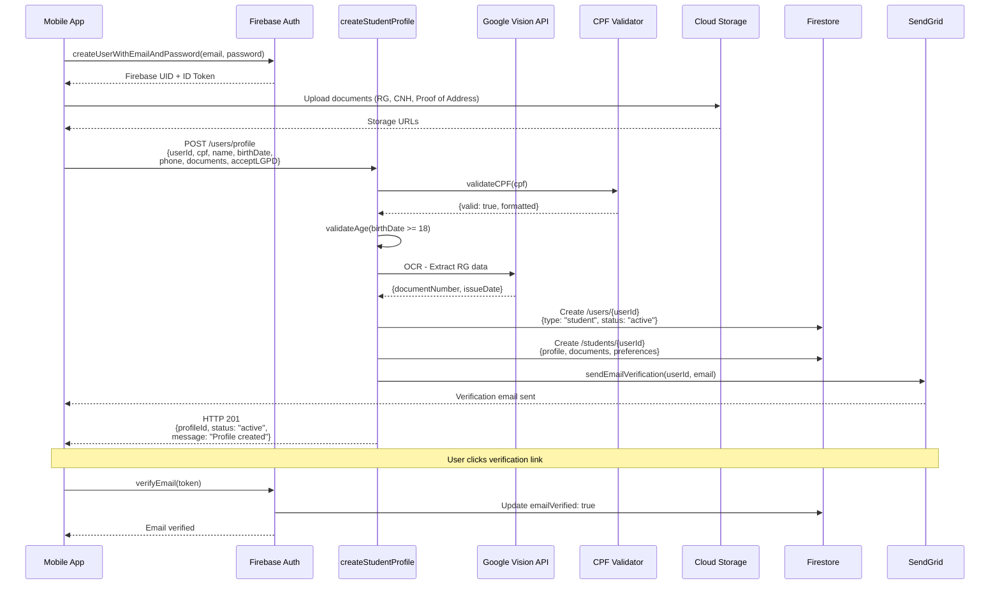

# Student Registration Flow

## Key Validations
1. **CPF**: Format validation + verification digits
2. **Age**: birthDate ≥ 18 years
3. **Documents**: OCR validation via Google Vision API
4. **LGPD**: Explicit consent required (acceptLGPD: true)

## Error Scenarios
- **400**: Invalid CPF, underage, missing documents
- **409**: CPF already registered
- **500**: OCR service failure, Firestore timeout

