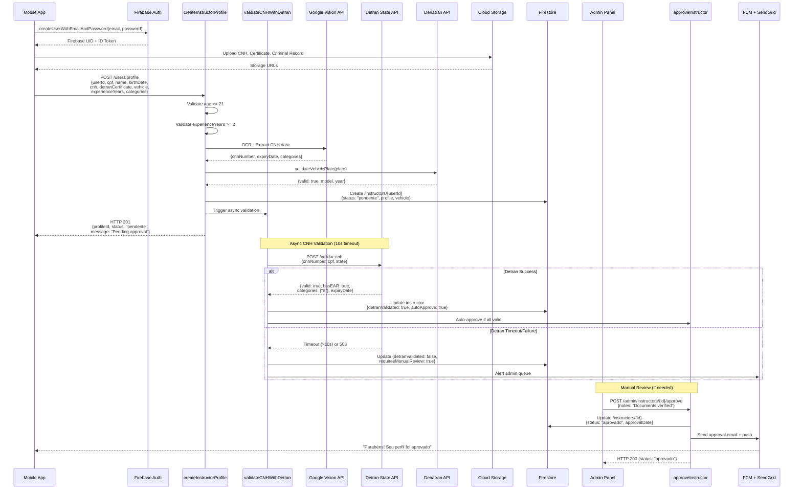
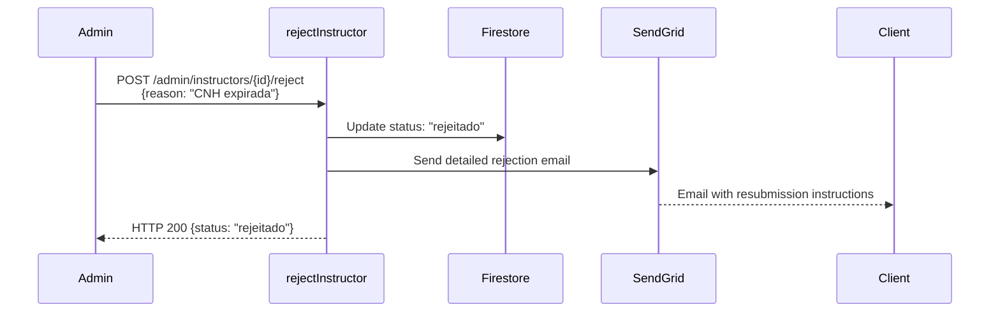

# Instructor Registration & Approval Flow

## Auto-Approval Criteria
1. ✅ CNH valid with EAR
2. ✅ Age >= 21 years
3. ✅ Experience >= 2 years
4. ✅ Vehicle plate valid (Denatran)
5. ✅ All documents pass OCR validation

## Rejection Scenarios

## State-Specific APIs
- **SP**: https://api.detran.sp.gov.br
- **RJ**: https://api.detran.rj.gov.br
- **MG**: https://api.detran.mg.gov.br
- Fallback: Manual upload queue

