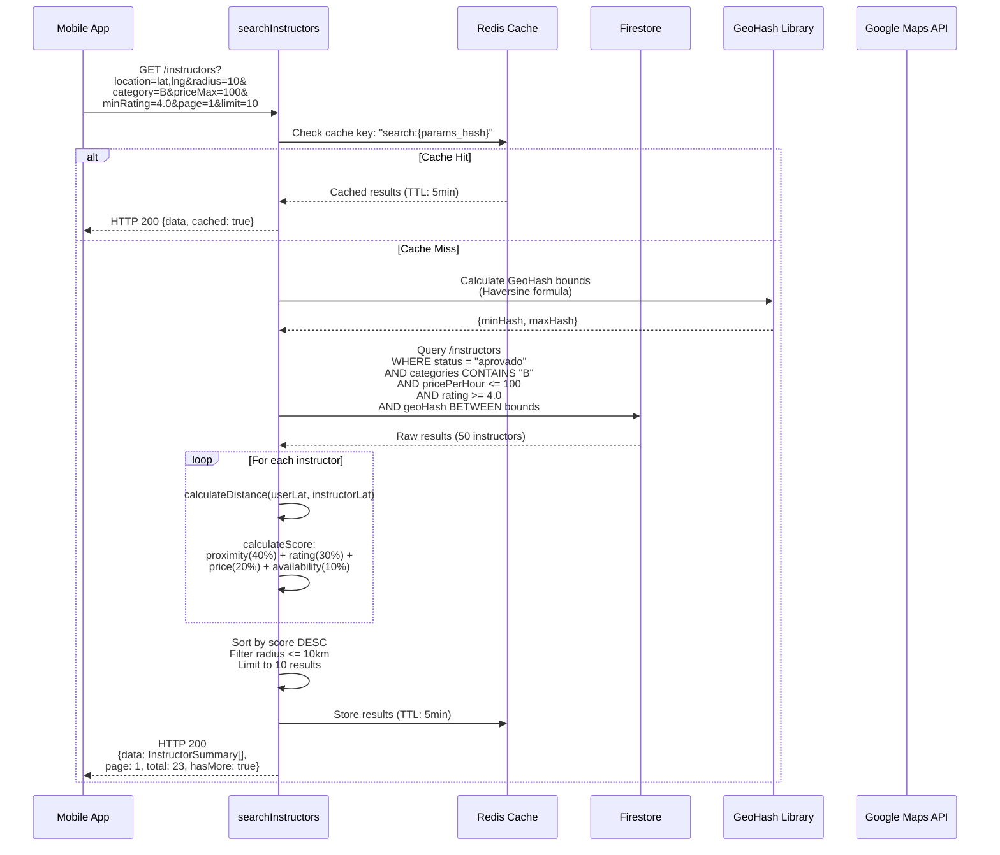
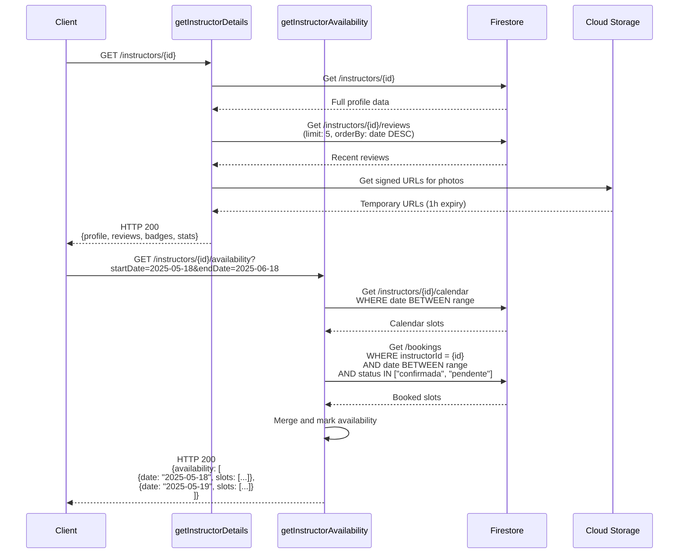

# Instructor Search & Discovery Flow



## Ranking Algorithm

```javascript
function calculateScore(instructor, userLocation, filters) {
  const proximity = 1 - (distance / maxRadius); // 40%
  const rating = instructor.rating / 5.0;        // 30%
  const price = 1 - (instructor.price / 150);    // 20%
  const availability = instructor.hasSlots ? 1 : 0.5; // 10%
  
  return (proximity * 0.4) + 
         (rating * 0.3) + 
         (price * 0.2) + 
         (availability * 0.1);
}
```

## Firestore Composite Indexes Required

```javascript
// Index 1: Search optimization
instructors: {
  status: ASC,
  categories: ARRAY,
  rating: DESC,
  pricePerHour: ASC,
  geoHash: ASC
}

// Index 2: Availability lookup
instructors/{id}/calendar: {
  date: ASC,
  available: ASC
}
```

## Instructor Profile View Flow



## Performance Optimizations

1. **Redis Caching**: 5-minute TTL for popular searches
2. **GeoHash Indexing**: O(log n) proximity queries
3. **Pagination**: Max 50 results per query
4. **CDN**: Static instructor photos via Firebase Hosting

