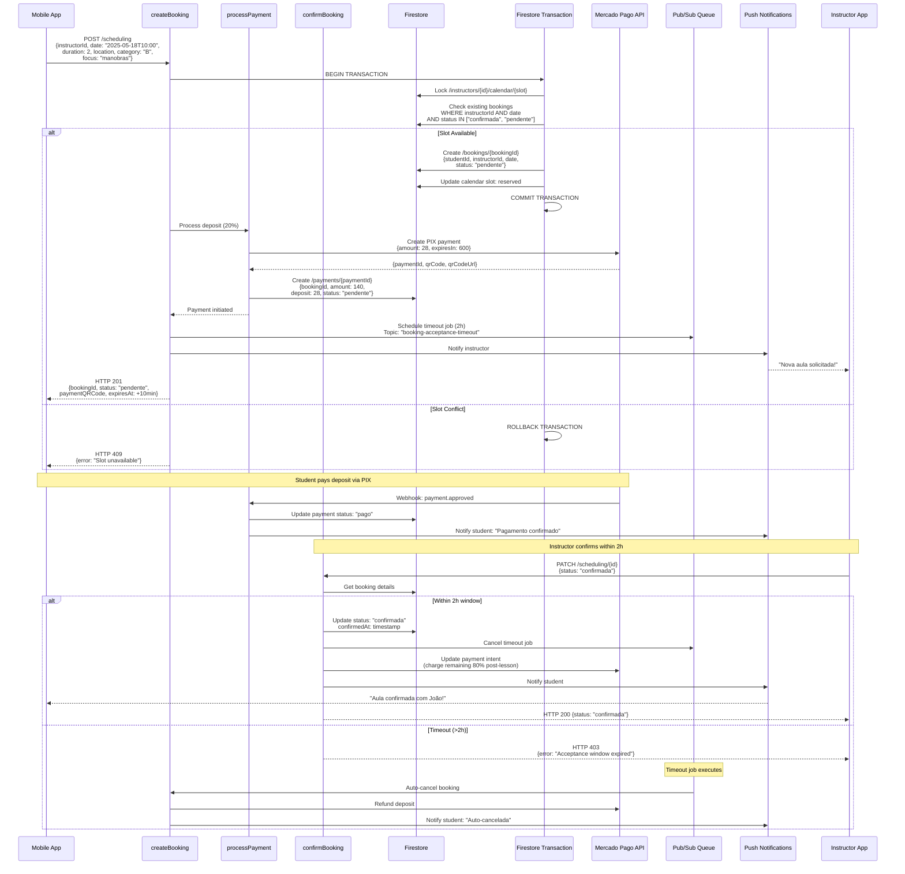
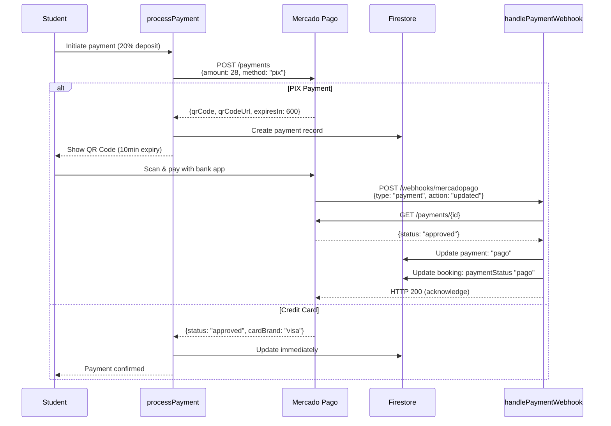
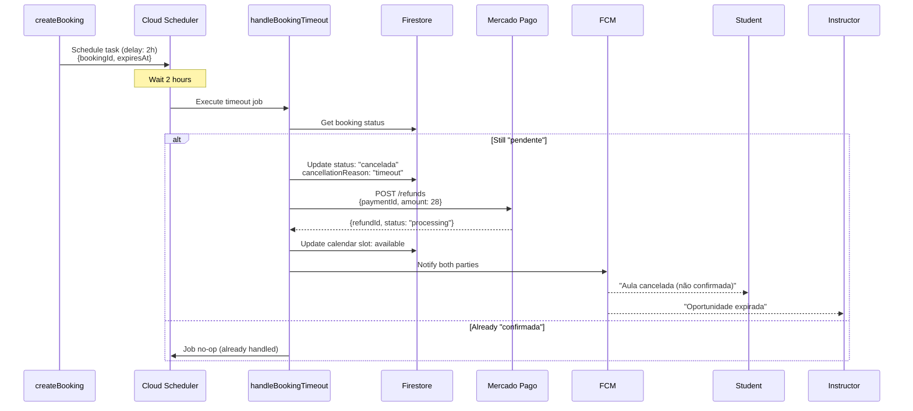
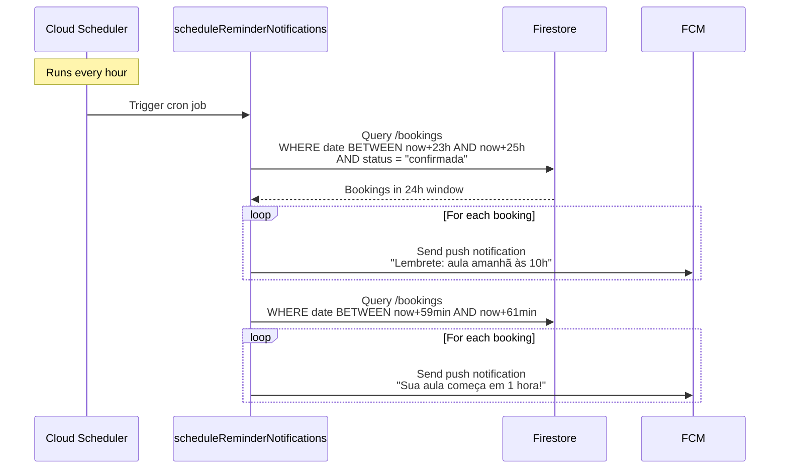

# Booking Creation & Confirmation Flow



## Payment Flow Details



## Atomic Lock Implementation

```typescript
// Firestore Transaction to prevent double-booking
async function createBookingWithLock(data) {
  const db = admin.firestore();
  
  return db.runTransaction(async (transaction) => {
    const slotRef = db
      .collection('instructors')
      .doc(data.instructorId)
      .collection('calendar')
      .doc(data.date);
    
    const slotDoc = await transaction.get(slotRef);
    
    if (!slotDoc.exists || slotDoc.data().reserved) {
      throw new Error('Slot unavailable');
    }
    
    // Check concurrent bookings
    const existingBookings = await transaction.get(
      db.collection('bookings')
        .where('instructorId', '==', data.instructorId)
        .where('date', '==', data.date)
        .where('status', 'in', ['pendente', 'confirmada'])
    );
    
    if (!existingBookings.empty) {
      throw new Error('Time conflict');
    }
    
    // Atomic writes
    const bookingRef = db.collection('bookings').doc();
    transaction.set(bookingRef, {
      ...data,
      status: 'pendente',
      createdAt: FieldValue.serverTimestamp()
    });
    
    transaction.update(slotRef, { reserved: true });
    
    return bookingRef.id;
  });
}
```

## Timeout Handling (Pub/Sub)



## Reminder Notifications



## Error Scenarios & Retries

| Error | Code | Retry Strategy | Fallback |
|-------|------|----------------|----------|
| Slot conflict | 409 | None (immediate feedback) | Show alternative slots |
| Payment timeout | 408 | Manual retry (new QR Code) | Try different payment method |
| Instructor no-show (2h) | Auto-cancel | Pub/Sub queue | Full refund + penalty to instructor |
| Firestore lock timeout | 503 | Exponential backoff (3 retries) | Queue for manual resolution |

