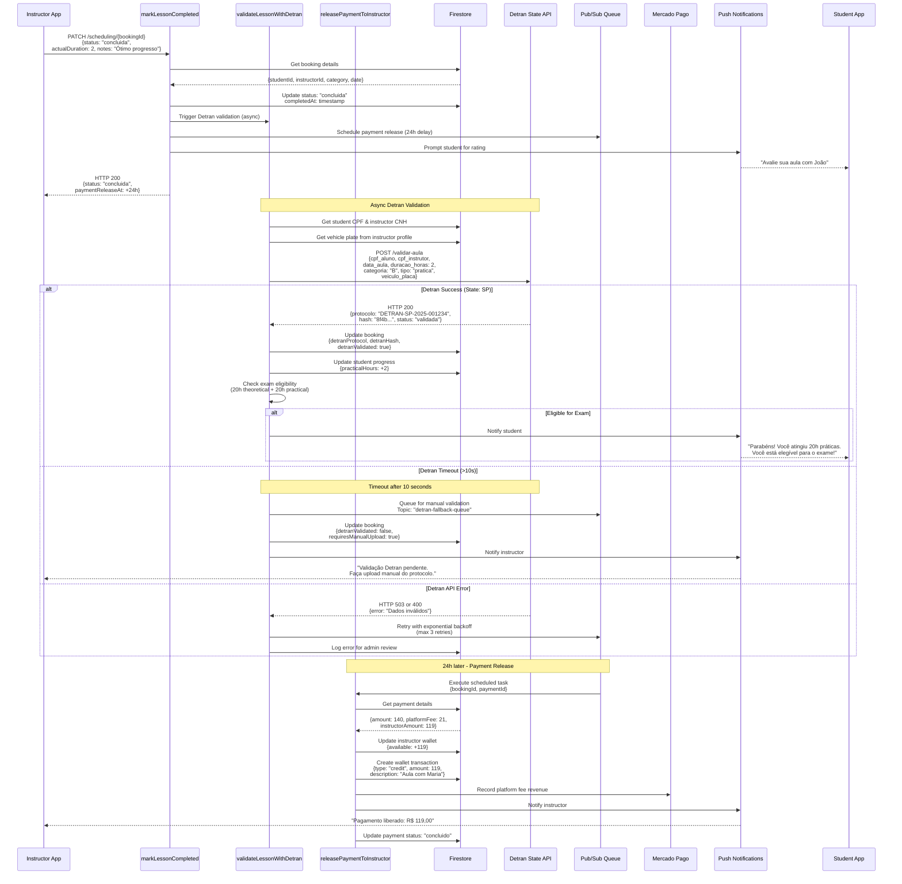
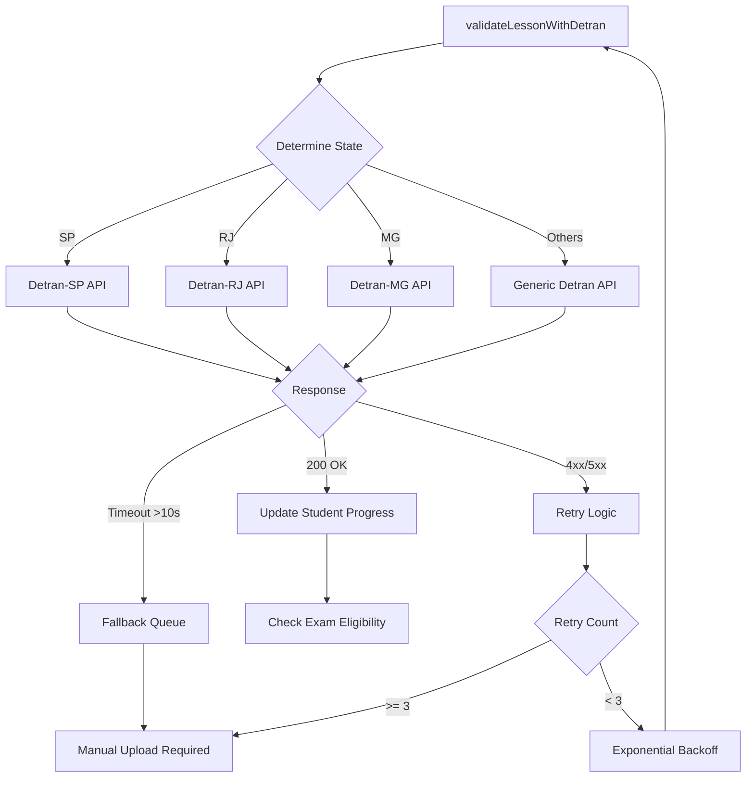
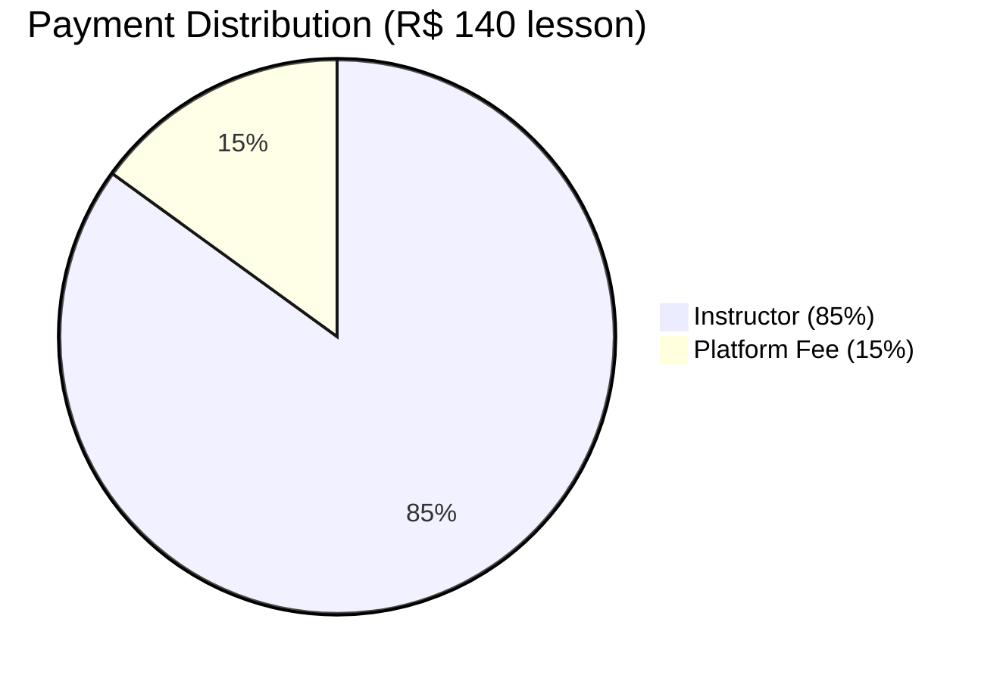
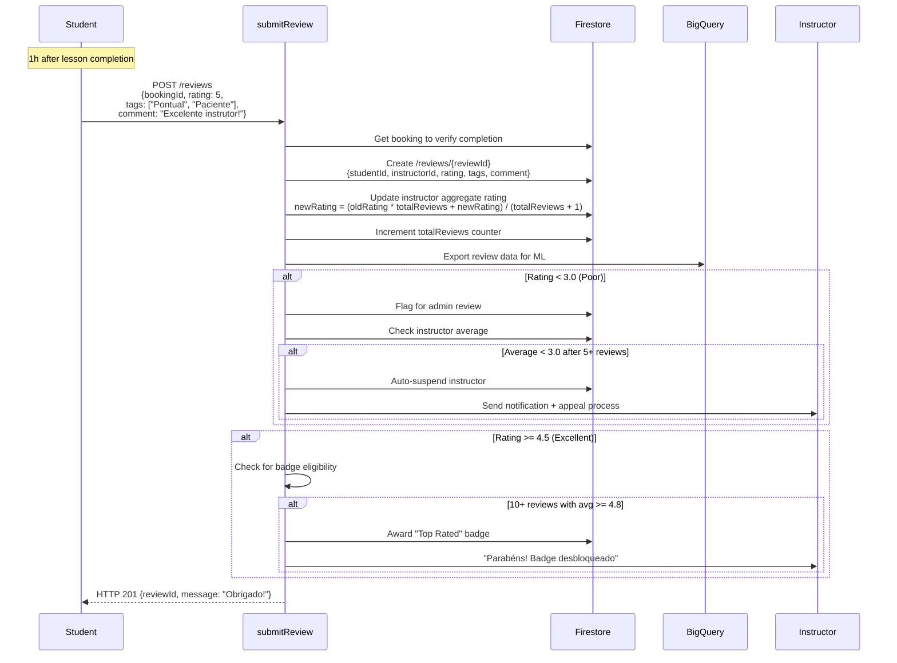
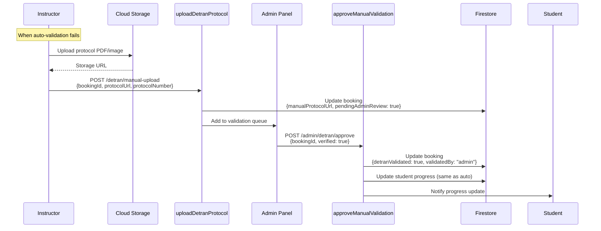

# Lesson Completion & Detran Validation Flow



## State-Specific Detran Integration



## Student Progress Calculation

```typescript
// Cloud Function: Update student progress after Detran validation
async function updateStudentProgress(
  studentId: string, 
  category: string, 
  duracao_horas: number, 
  tipo: 'teorica' | 'pratica'
) {
  const db = admin.firestore();
  const progressRef = db
    .collection('students')
    .doc(studentId)
    .collection('progress')
    .doc(category);
  
  await progressRef.set({
    [`${tipo}Hours`]: FieldValue.increment(duracao_horas),
    lastUpdated: FieldValue.serverTimestamp()
  }, { merge: true });
  
  // Check eligibility
  const progress = await progressRef.get();
  const data = progress.data();
  
  const eligible = 
    (data.teoricaHours >= 20) && 
    (data.praticaHours >= 20);
  
  if (eligible) {
    await progressRef.update({ examEligible: true });
    
    // Notify student
    await sendPushNotification(studentId, {
      title: 'Você está pronto!',
      body: 'Você completou as 20h teóricas e práticas. Agende seu exame!',
      data: { type: 'exam_eligible', category }
    });
  }
  
  return eligible;
}
```

## Payment Split & Commission



### Commission Breakdown
- **Base Rate**: 15% on all transactions
- **Pacote Discount**: 10% for packages ≥20h
- **First Lesson Promo**: 0% (platform absorbs cost)

### Payment Timeline
```
Lesson Completed (T=0)
    ↓
24h Hold Period (fraud/dispute window)
    ↓
Release to Instructor Wallet (T+24h)
    ↓
Instructor Requests Withdrawal
    ↓
PIX: Instant (R$2 fee) or TED: 1-2 business days
```

## Rating & Review Flow



## Manual Detran Validation (Fallback)



## Error Handling & Retries

| Scenario | HTTP Code | Retry Strategy | User Impact |
|----------|-----------|----------------|-------------|
| Detran timeout (>10s) | 503 | Exponential backoff (3x) then manual queue | Instructor notified to upload manually |
| Invalid CPF format | 400 | No retry | Immediate error to instructor |
| Network failure | 503 | Retry with jitter | Transparent to user |
| Student progress conflict | 409 | Transaction retry (atomic) | None (resolved automatically) |
| Payment release failure | 500 | Dead letter queue | Admin intervention required |

