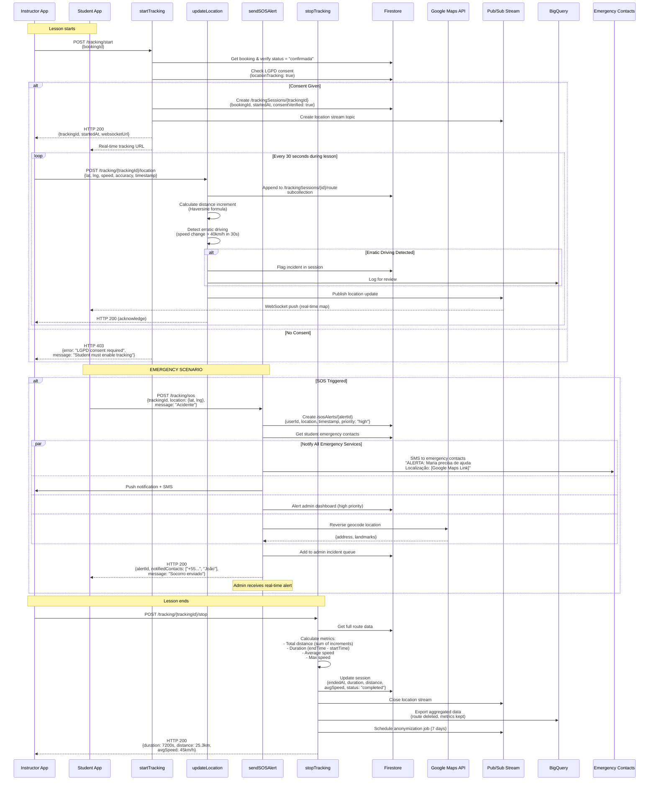
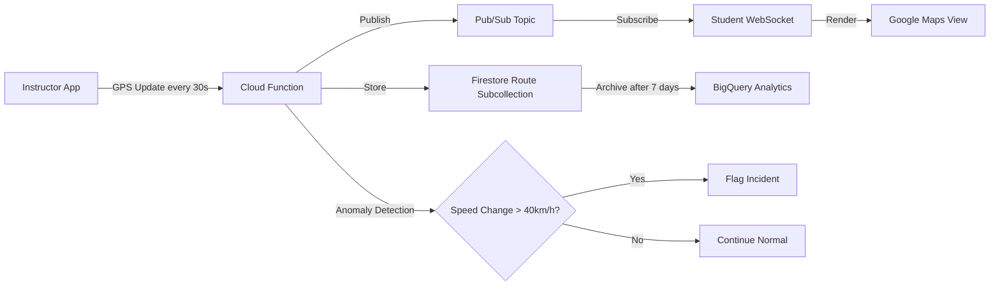
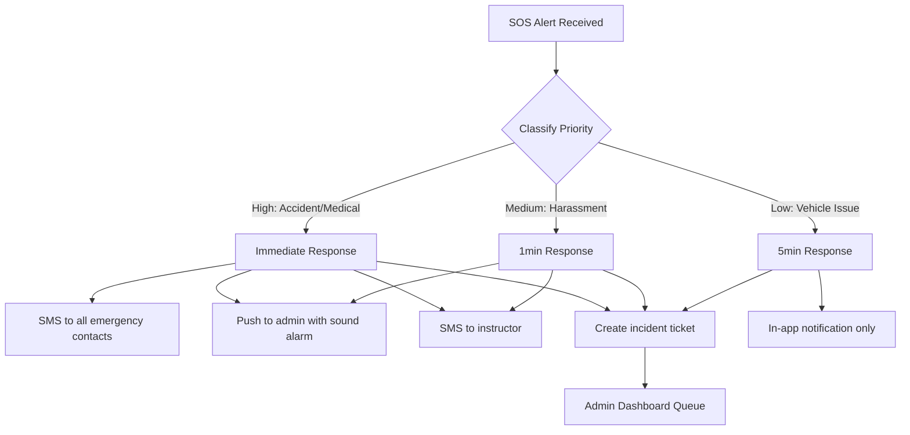

# GPS Tracking & SOS Emergency Flow



## Real-Time Location Streaming



## LGPD Compliance - Data Anonymization

```typescript
// Cloud Scheduler job: runs daily
async function anonymizeOldTrackingData() {
  const db = admin.firestore();
  const cutoffDate = new Date();
  cutoffDate.setDate(cutoffDate.getDate() - 7);
  
  const sessionsToAnonymize = await db
    .collection('trackingSessions')
    .where('endedAt', '<', cutoffDate)
    .where('anonymized', '==', false)
    .get();
  
  const batch = db.batch();
  
  for (const doc of sessionsToAnonymize.docs) {
    const sessionRef = doc.ref;
    
    // Delete detailed route points
    const routeSnapshot = await sessionRef
      .collection('route')
      .get();
    
    routeSnapshot.forEach(routeDoc => {
      batch.delete(routeDoc.ref);
    });
    
    // Keep only aggregated metrics
    batch.update(sessionRef, {
      anonymized: true,
      routeDeleted: true,
      anonymizedAt: FieldValue.serverTimestamp()
      // distance, duration, avgSpeed remain
    });
  }
  
  await batch.commit();
  
  console.log(`Anonymized ${sessionsToAnonymize.size} tracking sessions`);
}
```

## SOS Alert Priority Levels



## WebSocket Real-Time Updates

```typescript
// Client-side (Student App)
const trackingSocket = new WebSocket(
  `wss://api.autofacil.com/tracking/${trackingId}/stream`
);

trackingSocket.onmessage = (event) => {
  const location = JSON.parse(event.data);
  
  // Update map marker
  updateInstructorMarker({
    lat: location.lat,
    lng: location.lng,
    speed: location.speed,
    timestamp: location.timestamp
  });
  
  // Draw route trail (last 10 points)
  addToRoutePolyline(location);
};

// Server-side (Cloud Function via Pub/Sub)
pubsub.topic('tracking-updates').publish({
  trackingId,
  location: { lat, lng, speed },
  timestamp: Date.now()
});
```

## Erratic Driving Detection

```typescript
async function detectErratiDriving(
  trackingId: string, 
  currentSpeed: number, 
  previousSpeed: number
) {
  const speedDelta = Math.abs(currentSpeed - previousSpeed);
  const timeDelta = 30; // seconds between updates
  
  // Flag if acceleration/deceleration > 40km/h in 30s
  if (speedDelta > 40) {
    await db.collection('trackingSessions').doc(trackingId).update({
      incidents: FieldValue.arrayUnion({
        type: 'erratic_driving',
        timestamp: FieldValue.serverTimestamp(),
        speedChange: speedDelta,
        severity: speedDelta > 60 ? 'high' : 'medium'
      })
    });
    
    // Alert student in real-time
    await sendPushNotification(studentId, {
      title: 'Alerta de Segurança',
      body: 'Mudança brusca de velocidade detectada',
      priority: 'high'
    });
    
    // Log for analytics
    await logToAnalytics('safety_incident', {
      trackingId,
      type: 'erratic_driving',
      speedDelta
    });
  }
}
```

## Distance Calculation (Haversine)

```typescript
function calculateDistance(
  lat1: number, lng1: number,
  lat2: number, lng2: number
): number {
  const R = 6371; // Earth radius in km
  const dLat = toRad(lat2 - lat1);
  const dLng = toRad(lng2 - lng1);
  
  const a = 
    Math.sin(dLat / 2) * Math.sin(dLat / 2) +
    Math.cos(toRad(lat1)) * Math.cos(toRad(lat2)) *
    Math.sin(dLng / 2) * Math.sin(dLng / 2);
  
  const c = 2 * Math.atan2(Math.sqrt(a), Math.sqrt(1 - a));
  return R * c; // Distance in km
}

function toRad(degrees: number): number {
  return degrees * (Math.PI / 180);
}
```

## Storage & Performance

| Data Type | Storage Duration | Storage Location | Access Pattern |
|-----------|------------------|------------------|----------------|
| Route points (detailed) | 7 days | Firestore subcollection | Real-time writes, batch reads |
| Aggregated metrics | Permanent | Firestore main doc | Occasional reads |
| SOS alerts | 90 days | Firestore + Admin DB | Immediate on creation |
| Analytics export | Indefinite | BigQuery | Monthly reports |

### Firestore Structure
```
/trackingSessions/{trackingId}
  - bookingId: string
  - startedAt: timestamp
  - endedAt: timestamp
  - distance: number (km)
  - duration: number (seconds)
  - avgSpeed: number (km/h)
  - anonymized: boolean
  
  /route (subcollection - deleted after 7 days)
    /{pointId}
      - lat: number
      - lng: number
      - speed: number
      - accuracy: number
      - timestamp: timestamp
```

## Error Handling

| Scenario | Response | User Impact |
|----------|----------|-------------|
| GPS signal lost | Queue updates, sync when reconnected | Gaps in route trail |
| WebSocket disconnect | Auto-reconnect with exponential backoff | Brief map freeze |
| SOS SMS failure | Retry 3x, fallback to email | Delayed emergency notification |
| Storage quota exceeded | Compress old routes, archive to Cloud Storage | None (transparent) |

