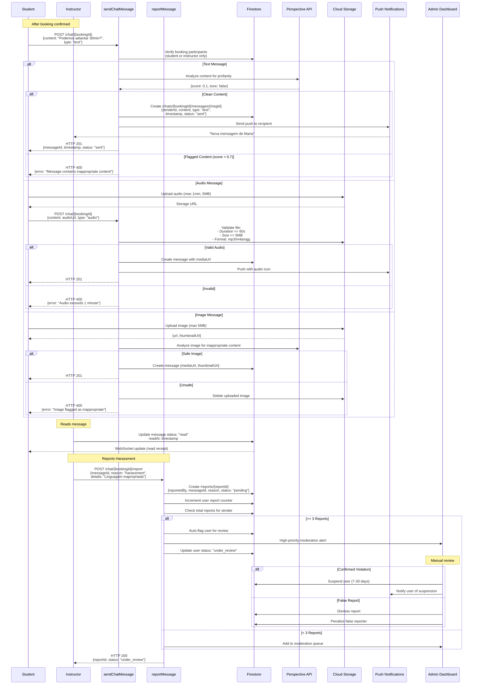
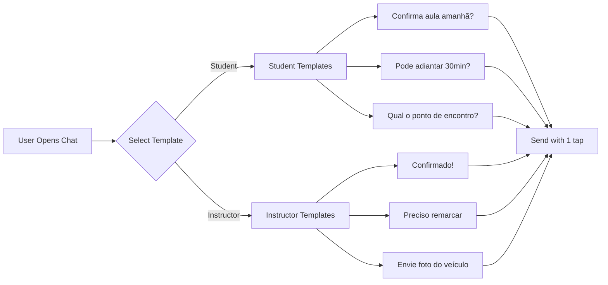
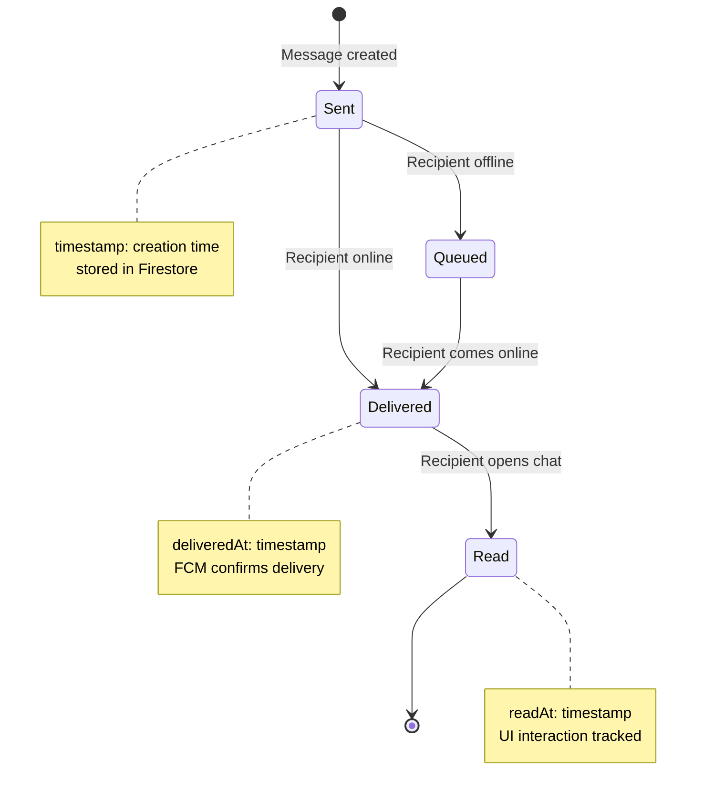
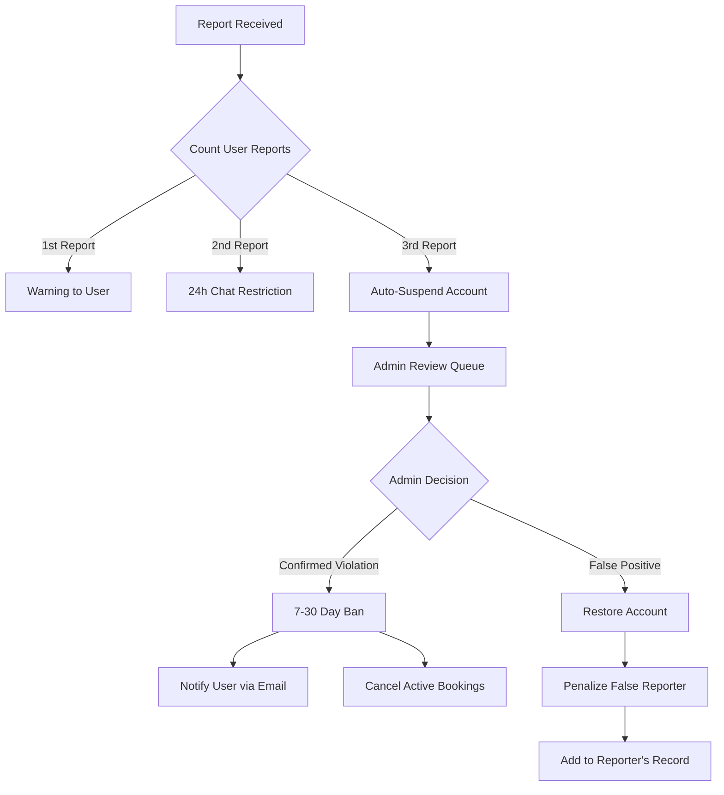

# Chat & Communication Flow



## Quick Reply Templates



## Message Status Lifecycle



## Profanity Filter Integration

```typescript
// Using Google Perspective API
async function moderateMessage(content: string): Promise<boolean> {
  const perspectiveApi = require('@google-cloud/perspective');
  
  const analyzeRequest = {
    comment: { text: content },
    requestedAttributes: {
      TOXICITY: {},
      SEVERE_TOXICITY: {},
      INSULT: {},
      PROFANITY: {},
      THREAT: {}
    },
    languages: ['pt']
  };
  
  const response = await perspectiveApi.comments.analyze(analyzeRequest);
  
  const scores = {
    toxicity: response.attributeScores.TOXICITY.summaryScore.value,
    severeToxicity: response.attributeScores.SEVERE_TOXICITY.summaryScore.value,
    insult: response.attributeScores.INSULT.summaryScore.value,
    profanity: response.attributeScores.PROFANITY.summaryScore.value,
    threat: response.attributeScores.THREAT.summaryScore.value
  };
  
  // Block if any score exceeds threshold
  const threshold = 0.7;
  const isClean = Object.values(scores).every(score => score < threshold);
  
  if (!isClean) {
    // Log for review
    await logModerationEvent({
      content,
      scores,
      action: 'blocked'
    });
  }
  
  return isClean;
}
```

## Auto-Ban Logic



## Firestore Chat Structure

```typescript
/chats/{bookingId}
  - participants: [studentId, instructorId]
  - createdAt: timestamp
  - lastMessage: string
  - lastMessageAt: timestamp
  
  /messages (subcollection)
    /{messageId}
      - senderId: string
      - senderName: string
      - content: string
      - type: "text" | "audio" | "image"
      - mediaUrl?: string
      - thumbnailUrl?: string
      - timestamp: timestamp
      - status: "sent" | "delivered" | "read"
      - deliveredAt?: timestamp
      - readAt?: timestamp
      - moderated: boolean
      - moderationScore?: number
```

## Real-Time Message Sync

```typescript
// Client-side listener (React Native)
useEffect(() => {
  const unsubscribe = firestore()
    .collection('chats')
    .doc(bookingId)
    .collection('messages')
    .orderBy('timestamp', 'desc')
    .limit(50)
    .onSnapshot((snapshot) => {
      const messages = snapshot.docs.map(doc => ({
        id: doc.id,
        ...doc.data()
      }));
      
      setMessages(messages);
      
      // Mark as delivered
      snapshot.docChanges().forEach(change => {
        if (change.type === 'added' && 
            change.doc.data().senderId !== currentUserId) {
          markAsDelivered(change.doc.id);
        }
      });
    });
  
  return () => unsubscribe();
}, [bookingId]);

// Mark as read when chat screen is focused
useEffect(() => {
  const focusListener = navigation.addListener('focus', () => {
    markAllMessagesAsRead(bookingId);
  });
  
  return focusListener;
}, [navigation]);
```

## Media Upload Validation

```typescript
async function validateMediaUpload(
  file: File, 
  type: 'audio' | 'image'
): Promise<ValidationResult> {
  
  const limits = {
    audio: { maxSize: 5 * 1024 * 1024, maxDuration: 60, formats: ['mp3', 'm4a', 'ogg'] },
    image: { maxSize: 5 * 1024 * 1024, formats: ['jpg', 'jpeg', 'png', 'webp'] }
  };
  
  const limit = limits[type];
  
  // Size check
  if (file.size > limit.maxSize) {
    return { valid: false, error: `File exceeds ${limit.maxSize / 1024 / 1024}MB` };
  }
  
  // Format check
  const extension = file.name.split('.').pop()?.toLowerCase();
  if (!limit.formats.includes(extension)) {
    return { valid: false, error: `Invalid format. Allowed: ${limit.formats.join(', ')}` };
  }
  
  // Audio duration check
  if (type === 'audio') {
    const duration = await getAudioDuration(file);
    if (duration > limit.maxDuration) {
      return { valid: false, error: `Audio exceeds ${limit.maxDuration}s` };
    }
  }
  
  return { valid: true };
}
```

## Performance Optimizations

### 1. Message Pagination
```typescript
// Load messages in batches of 50
async function loadMoreMessages(bookingId: string, lastVisible: DocumentSnapshot) {
  return firestore()
    .collection('chats')
    .doc(bookingId)
    .collection('messages')
    .orderBy('timestamp', 'desc')
    .startAfter(lastVisible)
    .limit(50)
    .get();
}
```

### 2. Image Optimization
```typescript
// Generate thumbnail on upload
const thumbnail = await sharp(imageBuffer)
  .resize(200, 200, { fit: 'cover' })
  .jpeg({ quality: 70 })
  .toBuffer();

await bucket.file(`thumbnails/${messageId}.jpg`).save(thumbnail);
```

### 3. FCM Batching
```typescript
// Batch notifications for efficiency
const messages = pendingNotifications.map(notification => ({
  token: notification.fcmToken,
  notification: {
    title: notification.title,
    body: notification.body
  },
  data: {
    bookingId: notification.bookingId,
    type: 'new_message'
  }
}));

await admin.messaging().sendAll(messages);
```

## Moderation Dashboard

| Metric | Threshold | Action |
|--------|-----------|--------|
| Toxic messages blocked | N/A | Log to analytics |
| User reports (1st) | 1 | In-app warning |
| User reports (2nd) | 2 | 24h chat restriction |
| User reports (3rd) | 3 | Auto-suspend + admin review |
| False reports | 3 | Penalize reporter (reduce trust score) |
| Average response time | < 5min | Display "Usually responds quickly" badge |

