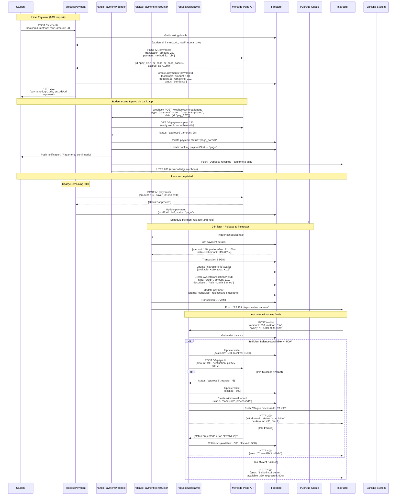
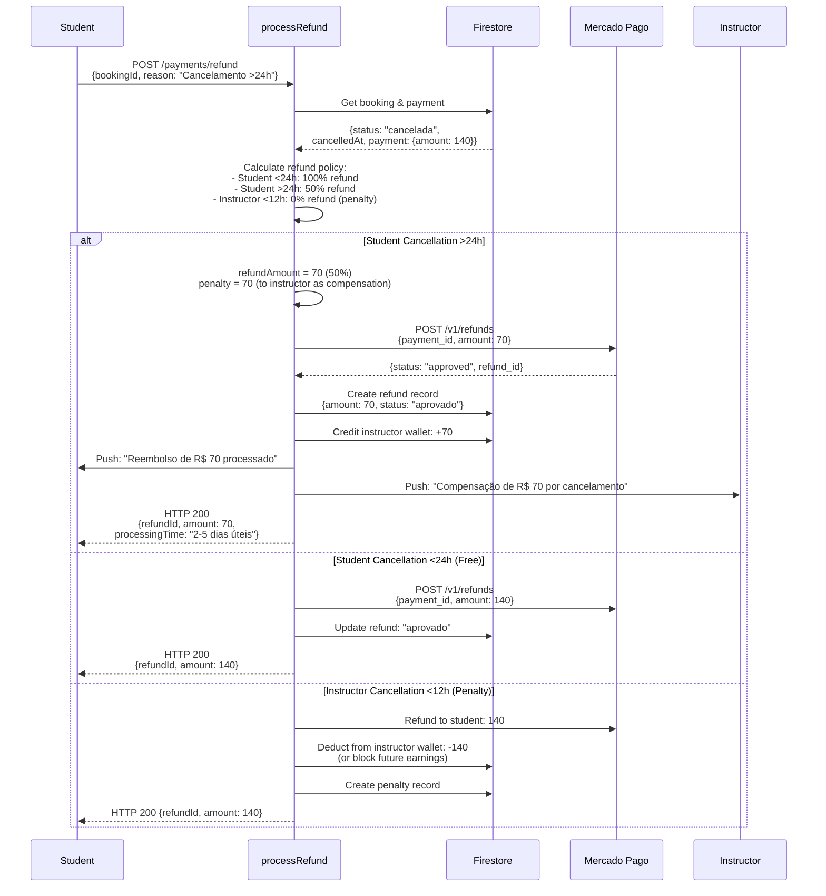
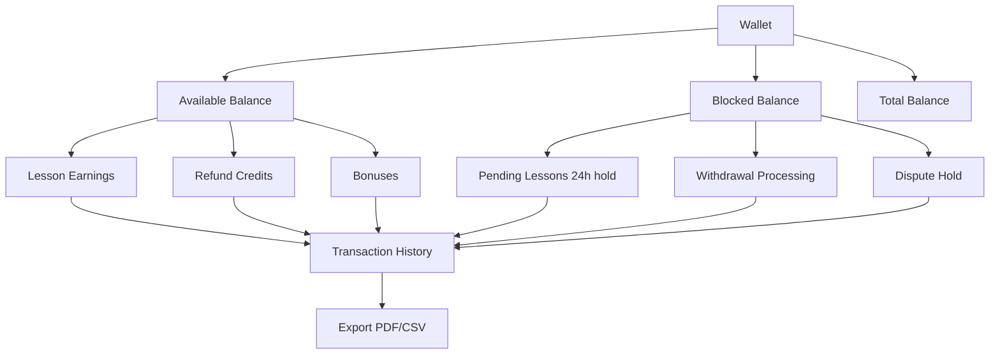
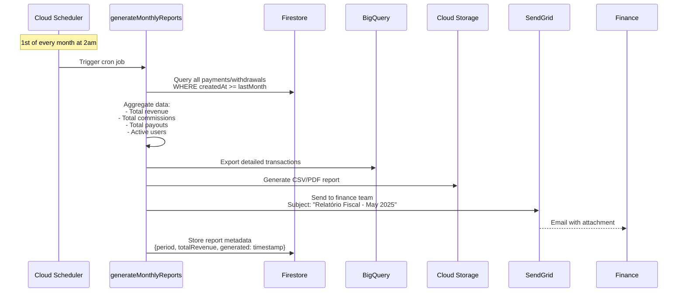

# Payment Processing & Wallet Management Flow



## Refund Processing



## Commission Calculation

```typescript
interface PaymentSplit {
  total: number;
  platformFee: number;
  instructorAmount: number;
  feePercentage: number;
}

function calculatePaymentSplit(
  lessonAmount: number,
  packageHours?: number
): PaymentSplit {
  let feePercentage = 0.15; // 15% default
  
  // Discounts
  if (packageHours >= 20) {
    feePercentage = 0.10; // 10% for packages ≥20h
  }
  
  const platformFee = Math.round(lessonAmount * feePercentage * 100) / 100;
  const instructorAmount = lessonAmount - platformFee;
  
  return {
    total: lessonAmount,
    platformFee,
    instructorAmount,
    feePercentage
  };
}

// Example: R$ 140 lesson
// Result: { total: 140, platformFee: 21, instructorAmount: 119, feePercentage: 0.15 }
```

## Wallet Transaction History



## Firestore Wallet Structure

```typescript
/instructors/{instructorId}/wallet
  - available: number        // Can withdraw
  - blocked: number          // Pending/processing
  - total: number            // Sum of both
  - lastUpdated: timestamp
  
/walletTransactions (collection)
  /{transactionId}
    - userId: string
    - type: "credit" | "debit" | "withdrawal"
    - amount: number
    - description: string
    - relatedBookingId?: string
    - relatedPaymentId?: string
    - status: "pendente" | "concluido" | "cancelado"
    - createdAt: timestamp
    - processedAt?: timestamp
```

## Payment Security

### 1. Webhook Validation
```typescript
async function validateMercadoPagoWebhook(
  signature: string,
  payload: any
): Promise<boolean> {
  const secret = process.env.MERCADO_PAGO_WEBHOOK_SECRET;
  const hmac = crypto
    .createHmac('sha256', secret)
    .update(JSON.stringify(payload))
    .digest('hex');
  
  return crypto.timingSafeEqual(
    Buffer.from(signature),
    Buffer.from(hmac)
  );
}
```

### 2. Card Data Encryption (PCI DSS)
```typescript
// Never store raw card data - use MP tokenization
async function processCardPayment(cardData: {
  cardNumber: string,
  cvv: string,
  expiryDate: string
}) {
  // Client-side tokenization via Mercado Pago SDK
  const token = await MercadoPago.createCardToken(cardData);
  
  // Send only token to backend
  return fetch('/api/payments', {
    method: 'POST',
    body: JSON.stringify({
      cardToken: token,
      amount: 140
    })
  });
}
```

### 3. Fraud Detection
```typescript
async function detectFraudulentPayment(
  paymentData: PaymentRequest
): Promise<{ fraudScore: number, block: boolean }> {
  const indicators = {
    multipleFailedAttempts: await checkFailedAttempts(paymentData.userId),
    unusualAmount: paymentData.amount > 1000,
    newUserHighValue: await isNewUser(paymentData.userId) && paymentData.amount > 500,
    velocityCheck: await checkPaymentVelocity(paymentData.userId)
  };
  
  let fraudScore = 0;
  if (indicators.multipleFailedAttempts > 3) fraudScore += 30;
  if (indicators.unusualAmount) fraudScore += 20;
  if (indicators.newUserHighValue) fraudScore += 25;
  if (indicators.velocityCheck > 5) fraudScore += 25;
  
  return {
    fraudScore,
    block: fraudScore >= 70
  };
}
```

## Withdrawal Methods Comparison

| Method | Processing Time | Fee | Min Amount | Max Amount |
|--------|----------------|-----|------------|------------|
| PIX | Instant | R$ 2.00 | R$ 100 | R$ 5,000 |
| TED | 1-2 business days | R$ 0.00 | R$ 100 | R$ 10,000 |
| DOC | 2-3 business days | R$ 0.00 | R$ 100 | R$ 4,999 |

## Monthly Fiscal Reports



## Error Handling

| Error | Code | Retry | Fallback |
|-------|------|-------|----------|
| Payment timeout | 408 | User retries | Generate new QR Code |
| Insufficient funds | 400 | None | Display balance |
| Invalid PIX key | 400 | None | Validate before submit |
| Webhook replay attack | 403 | None | Idempotency check |
| Withdrawal limit exceeded | 400 | None | Show daily limit |
| Mercado Pago API down | 503 | 3 retries with backoff | Queue for later |

