# LGPD Compliance & Data Management Flow

```mermaid
sequenceDiagram
    participant User as User (Student/Instructor)
    participant CF1 as exportUserData
    participant CF2 as deleteUserAccount
    participant CF3 as updateConsentPreferences
    participant DB as Firestore
    participant Storage as Cloud Storage
    participant PubSub as Pub/Sub Queue
    participant Scheduler as Cloud Scheduler
    participant Email as SendGrid
    participant Auth as Firebase Auth

    Note over User,CF1: LGPD Right to Data Portability
    
    User->>CF1: GET /lgpd/data-export
    
    CF1->>DB: Create export job<br/>{userId, status: "processing", requestedAt}
    
    CF1->>PubSub: Queue async export job
    
    CF1-->>User: HTTP 202<br/>{exportId, status: "processing",<br/>estimatedTime: "5-10 minutes"}
    
    Note over PubSub: Async processing
    
    PubSub->>CF1: Execute export job
    
    par Collect All User Data
        CF1->>DB: Get /users/{userId}
    and
        CF1->>DB: Get /students or /instructors/{userId}
    and
        CF1->>DB: Get /bookings WHERE studentId OR instructorId
    and
        CF1->>DB: Get /payments WHERE userId
    and
        CF1->>DB: Get /chats WHERE userId in participants
    and
        CF1->>DB: Get /trackingSessions WHERE userId
    and
        CF1->>DB: Get /reviews WHERE userId
    and
        CF1->>DB: Get /walletTransactions WHERE userId
    end
    
    CF1->>CF1: Compile data to JSON/CSV:<br/>{profile, bookings, payments,<br/>messages, tracking, reviews}
    
    CF1->>Storage: Upload to /exports/{exportId}.json<br/>(signed URL, 7-day expiry)
    
    CF1->>DB: Update export job<br/>{status: "ready", downloadUrl, expiresAt}
    
    CF1->>Email: Send download link
    Email-->>User: "Seus dados estão prontos para download"
    
    User->>CF1: GET /lgpd/data-export/{exportId}
    
    CF1->>DB: Get export job
    
    alt Export Ready
        CF1->>Storage: Get signed URL (1h expiry)
        CF1-->>User: HTTP 200<br/>{downloadUrl, expiresAt: +7 days}
        
    else Still Processing
        CF1-->>User: HTTP 200<br/>{status: "processing"}
    end
    
    Note over User,CF2: LGPD Right to be Forgotten
    
    User->>CF2: DELETE /lgpd/delete-account<br/>{confirmPassword, reason: "privacy_concerns",<br/>feedback: "Não uso mais"}
    
    CF2->>Auth: Verify password
    
    alt Password Valid
        CF2->>DB: Get active bookings
        
        loop For each active booking
            CF2->>DB: Cancel booking
            CF2->>PubSub: Trigger refund
        end
        
        CF2->>DB: Create deletion request<br/>{userId, scheduledFor: +30 days,<br/>cancellationDeadline: +30 days}
        
        CF2->>DB: Anonymize user data:<br/>name → "Usuário###",<br/>email → "deleted###@autofacil.com",<br/>phone → null
        
        CF2->>Auth: Disable Firebase Auth account
        
        CF2->>Scheduler: Schedule permanent deletion (30 days)
        
        CF2->>Email: Send confirmation email
        Email-->>User: "Sua conta será deletada em 30 dias.<br/>Cancele até DD/MM/AAAA"
        
        CF2-->>User: HTTP 200<br/>{deletionId, scheduledDate: +30 days,<br/>cancellationDeadline}
        
    else Invalid Password
        CF2-->>User: HTTP 401<br/>{error: "Senha incorreta"}
    end
    
    Note over User: User changes mind within 30 days
    
    User->>CF2: POST /lgpd/delete-account/cancel
    
    CF2->>DB: Get deletion request
    
    alt Within Grace Period
        CF2->>DB: Delete deletion request
        
        CF2->>DB: Restore user data:<br/>(if not fully anonymized yet)
        
        CF2->>Auth: Re-enable Firebase Auth account
        
        CF2->>Scheduler: Cancel scheduled deletion job
        
        CF2->>Email: Send confirmation
        Email-->>User: "Conta restaurada com sucesso"
        
        CF2-->>User: HTTP 200<br/>{status: "cancelled", accountRestored: true}
        
    else Grace Period Expired
        CF2-->>User: HTTP 404<br/>{error: "Deletion already processed"}
    end
    
    Note over Scheduler: 30 days later - Permanent deletion
    
    Scheduler->>CF2: Execute deletion job
    
    CF2->>DB: Delete /users/{userId}
    CF2->>DB: Delete /students or /instructors/{userId}
    CF2->>DB: Anonymize /bookings (keep for fiscal records)
    CF2->>DB: Delete /chats/{bookingId}/messages
    CF2->>DB: Delete /trackingSessions
    CF2->>DB: Anonymize /payments (keep for auditing)
    CF2->>Storage: Delete profile photos, documents
    CF2->>Auth: Permanently delete Firebase user
    
    CF2->>DB: Log deletion event (audit trail)
    
    Note over User,CF3: LGPD Consent Management
    
    User->>CF3: PATCH /lgpd/consent<br/>{locationTracking: false,<br/>dataSharing: true,<br/>marketing: false,<br/>thirdPartySharing: true}
    
    CF3->>DB: Update /users/{userId}/lgpdConsent<br/>{preferences, updatedAt: timestamp}
    
    CF3->>DB: Log consent change (audit trail)<br/>/consentHistory/{logId}
    
    CF3-->>User: HTTP 200<br/>{preferences, updatedAt}
    
    Note over CF3: Enforce consent preferences
    
    alt locationTracking = false
        CF3->>DB: Block GPS tracking initiation
        CF3-->>User: "GPS tracking disabled per your preferences"
        
    else marketing = false
        CF3->>DB: Unsubscribe from promotional emails
        CF3->>Email: Update mailing list
    end
```



## Anonymization Strategy

```mermaid
graph TD
    A[User Data] --> B{Anonymization Type}
    
    B -->|Personal Info| C[Replace with Generic]
    B -->|Financial Data| D[Keep for 5 years fiscal]
    B -->|Location Data| E[Delete after 7 days]
    B -->|Messages| F[Delete immediately]
    
    C --> G[name → "Usuário12345"]
    C --> H[email → "deleted12345@autofacil.com"]
    C --> I[CPF → hash]
    C --> J[phone → null]
    
    D --> K[Keep aggregated metrics]
    D --> L[Remove identifiable links]
    
    E --> M[Delete GPS coordinates]
    E --> N[Keep distance/duration]
    
    F --> O[Delete chat history]
    F --> P[Keep moderation flags]
```

## Data Retention Policy

```typescript
interface DataRetentionPolicy {
  category: string;
  retentionPeriod: string;
  purpose: string;
  anonymizationRule: string;
}

const retentionPolicies: DataRetentionPolicy[] = [
  {
    category: 'User Profile',
    retentionPeriod: 'Active + 5 years',
    purpose: 'Account management',
    anonymizationRule: 'Replace PII with generic identifiers'
  },
  {
    category: 'GPS Tracking Data',
    retentionPeriod: '7 days',
    purpose: 'Safety & quality assurance',
    anonymizationRule: 'Delete route points, keep aggregated metrics'
  },
  {
    category: 'Chat Messages',
    retentionPeriod: 'Until account deletion',
    purpose: 'Communication & dispute resolution',
    anonymizationRule: 'Permanent deletion'
  },
  {
    category: 'Payment Records',
    retentionPeriod: '5 years (fiscal)',
    purpose: 'Legal compliance & auditing',
    anonymizationRule: 'Remove user link, keep transaction metadata'
  },
  {
    category: 'Booking History',
    retentionPeriod: '5 years (fiscal)',
    purpose: 'Service history & Detran validation',
    anonymizationRule: 'Anonymize student/instructor names, keep protocol'
  },
  {
    category: 'Consent Logs',
    retentionPeriod: '10 years (legal)',
    purpose: 'LGPD compliance proof',
    anonymizationRule: 'Never delete (audit trail)'
  }
];
```

## Scheduled Anonymization Job

```typescript
// Cloud Scheduler: Runs daily at 3am
export const anonymizeOldData = functions.pubsub
  .schedule('0 3 * * *')
  .timeZone('America/Sao_Paulo')
  .onRun(async (context) => {
    const db = admin.firestore();
    const cutoffDate = new Date();
    
    // Anonymize GPS tracking > 7 days old
    cutoffDate.setDate(cutoffDate.getDate() - 7);
    
    const oldTrackingSessions = await db
      .collection('trackingSessions')
      .where('endedAt', '<', cutoffDate)
      .where('anonymized', '==', false)
      .get();
    
    const batch = db.batch();
    
    for (const doc of oldTrackingSessions.docs) {
      // Delete route subcollection
      const routeRef = doc.ref.collection('route');
      const routeDocs = await routeRef.get();
      
      routeDocs.forEach(routeDoc => {
        batch.delete(routeDoc.ref);
      });
      
      // Mark as anonymized
      batch.update(doc.ref, {
        anonymized: true,
        anonymizedAt: admin.firestore.FieldValue.serverTimestamp(),
        routePointsDeleted: routeDocs.size
      });
    }
    
    await batch.commit();
    
    console.log(`Anonymized ${oldTrackingSessions.size} tracking sessions`);
    
    // Anonymize inactive accounts > 5 years
    cutoffDate.setFullYear(cutoffDate.getFullYear() - 5);
    
    const inactiveUsers = await db
      .collection('users')
      .where('lastActivity', '<', cutoffDate)
      .where('anonymized', '==', false)
      .get();
    
    for (const userDoc of inactiveUsers.docs) {
      await anonymizeUserAccount(userDoc.id, 'inactive_5years');
    }
    
    console.log(`Anonymized ${inactiveUsers.size} inactive accounts`);
  });
```

## Consent Preference Enforcement

```typescript
// Middleware: Check consent before tracking
async function enforceLocationConsent(
  userId: string, 
  action: 'start_tracking'
): Promise<boolean> {
  const db = admin.firestore();
  
  const consentDoc = await db
    .collection('users')
    .doc(userId)
    .collection('lgpdConsent')
    .doc('current')
    .get();
  
  const consent = consentDoc.data();
  
  if (!consent?.locationTracking) {
    throw new Error('User has not consented to location tracking (LGPD)');
  }
  
  // Log consent verification (audit trail)
  await db.collection('consentVerifications').add({
    userId,
    action,
    consentGiven: true,
    verifiedAt: admin.firestore.FieldValue.serverTimestamp()
  });
  
  return true;
}

// Example usage in startTracking Cloud Function
export const startTracking = functions.https.onCall(async (data, context) => {
  const userId = context.auth?.uid;
  
  if (!userId) {
    throw new functions.https.HttpsError('unauthenticated', 'User not authenticated');
  }
  
  try {
    await enforceLocationConsent(userId, 'start_tracking');
    
    // Proceed with tracking...
    
  } catch (error) {
    throw new functions.https.HttpsError(
      'permission-denied',
      error.message
    );
  }
});
```

## Data Export Format

```json
{
  "exportId": "exp_abc123",
  "userId": "user_xyz789",
  "exportedAt": "2025-11-13T10:30:00Z",
  "expiresAt": "2025-11-20T10:30:00Z",
  "data": {
    "profile": {
      "name": "Maria Santos",
      "email": "maria@example.com",
      "cpf": "123.456.789-00",
      "phone": "+5511999999999",
      "createdAt": "2024-05-10T14:20:00Z"
    },
    "preferences": {
      "category": "B",
      "budget": 80
    },
    "lgpdConsent": {
      "locationTracking": true,
      "dataSharing": false,
      "marketing": true,
      "updatedAt": "2025-01-15T09:00:00Z"
    },
    "bookings": [
      {
        "id": "book_123",
        "instructorName": "João Silva",
        "date": "2025-05-18T10:00:00Z",
        "duration": 2,
        "category": "B",
        "status": "concluida",
        "amount": 140
      }
    ],
    "payments": [
      {
        "id": "pay_456",
        "amount": 140,
        "method": "pix",
        "status": "pago",
        "date": "2025-05-18T09:45:00Z"
      }
    ],
    "messages": [
      {
        "bookingId": "book_123",
        "content": "Podemos adiantar 30min?",
        "timestamp": "2025-05-17T15:30:00Z",
        "sentBy": "me"
      }
    ],
    "trackingSessions": [
      {
        "bookingId": "book_123",
        "distance": 25.3,
        "duration": 7200,
        "startedAt": "2025-05-18T10:00:00Z"
      }
    ],
    "reviews": [
      {
        "instructorName": "João Silva",
        "rating": 5,
        "comment": "Excelente instrutor!",
        "date": "2025-05-18T12:30:00Z"
      }
    ]
  }
}
```

## Audit Trail

```typescript
// Log all LGPD-related actions
async function logLGPDAction(
  userId: string,
  action: 'export' | 'delete' | 'consent_update' | 'anonymize',
  details: any
) {
  const db = admin.firestore();
  
  await db.collection('lgpdAuditLog').add({
    userId,
    action,
    details,
    timestamp: admin.firestore.FieldValue.serverTimestamp(),
    ipAddress: details.ipAddress,
    userAgent: details.userAgent
  });
  
  // Also export to BigQuery for long-term storage
  const bigquery = new BigQuery();
  await bigquery
    .dataset('compliance')
    .table('lgpd_audit')
    .insert([{
      user_id: userId,
      action,
      details: JSON.stringify(details),
      timestamp: new Date().toISOString()
    }]);
}
```

## User Rights Summary

| Right | Endpoint | Processing Time | Notes |
|-------|----------|-----------------|-------|
| Access (Portability) | GET /lgpd/data-export | 5-10 minutes | 7-day download link |
| Rectification | PATCH /students/me or /instructors/me | Immediate | Standard profile update |
| Deletion (Erasure) | DELETE /lgpd/delete-account | 30-day grace period | Anonymization, not full delete |
| Consent Management | PATCH /lgpd/consent | Immediate | Affects features availability |
| Object to Processing | Contact support | Manual review | Case-by-case basis |
| Data Portability | GET /lgpd/data-export | Same as Access | JSON/CSV format |

