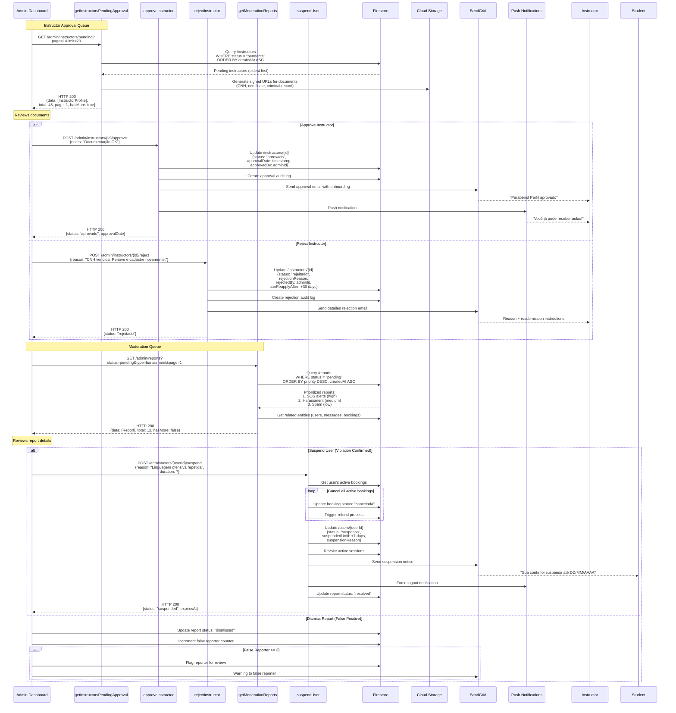

# Admin Panel & Moderation Flow



## Admin Dashboard Metrics

```mermaid
graph TD
    A[Admin Dashboard] --> B[KPIs Widget]
    A --> C[Charts Widget]
    A --> D[Moderation Queue]
    A --> E[User Management]
    A --> F[Financial Reports]
    
    B --> B1[MAU: 1.2M]
    B --> B2[Monthly Revenue: R$ 450K]
    B --> B3[Avg Commission: R$ 21]
    B --> B4[Conversion Rate: 12%]
    
    C --> C1[Lessons per Day Graph]
    C --> C2[Categories Distribution Pie]
    C --> C3[State Heat Map]
    
    D --> D1[45 Pending Instructors]
    D --> D2[12 Reports to Review]
    D --> D3[3 SOS Alerts Active]
    
    E --> E1[Search Users by CPF]
    E --> E2[View Transaction History]
    E --> E3[Suspend/Ban Actions]
    
    F --> F1[Monthly Revenue Export]
    F --> F2[Tax Reports CSV]
    F --> F3[Instructor Payouts Summary]
```



## Priority Queue Algorithm

```typescript
interface Report {
  id: string;
  type: 'chat' | 'profile' | 'behavior' | 'sos';
  severity: 'high' | 'medium' | 'low';
  createdAt: Date;
  status: 'pending' | 'reviewed' | 'resolved';
}

function prioritizeReports(reports: Report[]): Report[] {
  const priorityMap = {
    sos: 1000,
    harassment: 500,
    fraud: 400,
    spam: 100
  };
  
  const severityMultiplier = {
    high: 3,
    medium: 2,
    low: 1
  };
  
  return reports.sort((a, b) => {
    const scoreA = 
      (priorityMap[a.type] || 0) * 
      severityMultiplier[a.severity] -
      (Date.now() - a.createdAt.getTime()) / 1000;
    
    const scoreB = 
      (priorityMap[b.type] || 0) * 
      severityMultiplier[b.severity] -
      (Date.now() - b.createdAt.getTime()) / 1000;
    
    return scoreB - scoreA; // Higher score = higher priority
  });
}
```

## Performance Metrics

| Metric | Target | Current | Alert Threshold |
|--------|--------|---------|-----------------|
| Instructor Approval Time | < 24h | 18h avg | > 48h |
| Report Resolution Time | < 2h (high priority) | 1.5h avg | > 4h |
| SOS Response Time | < 5min | 3min avg | > 10min |
| False Report Rate | < 5% | 3.2% | > 10% |
| Admin Active Users | 5-10 | 7 | < 3 |
| Dashboard Load Time | < 2s | 1.8s | > 3s |

